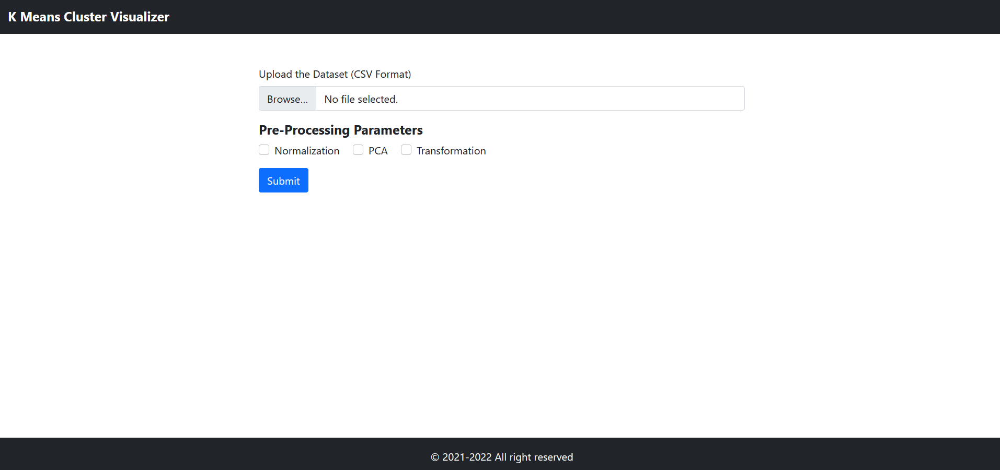
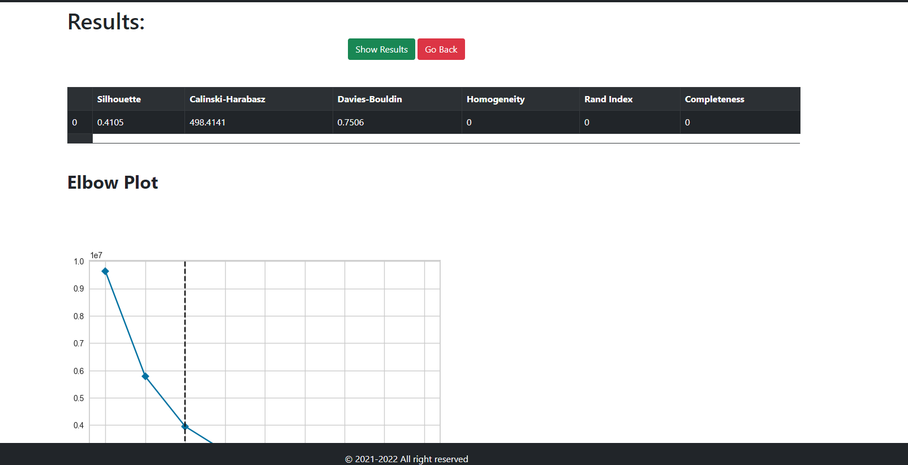

# K means Clustering Visualizer 


## Description 📓

A web based application to visualize K-Means clusters for small datasets

## Tech Stack 🧑‍💻

1. Pycaret (A famous ML library)
2. Flask 
3. HTML
4. CSS 
5. JS 
6. JQuery 

## Installation and Setup 🖥️

1. Install latest version of Python 
2. Run the commands shown below: 

```
pip install < requirements.txt
python app.py
```


## Screenshots 📟





## Built by developers </>
## Built with ❤️